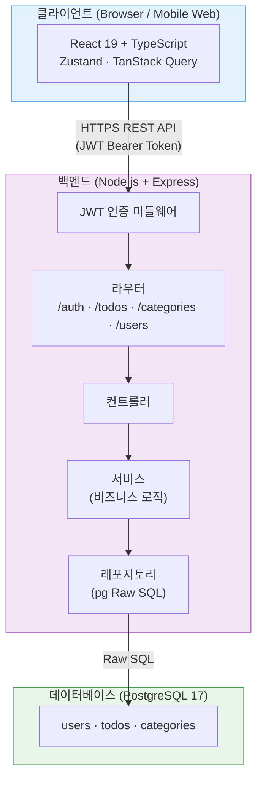
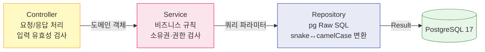
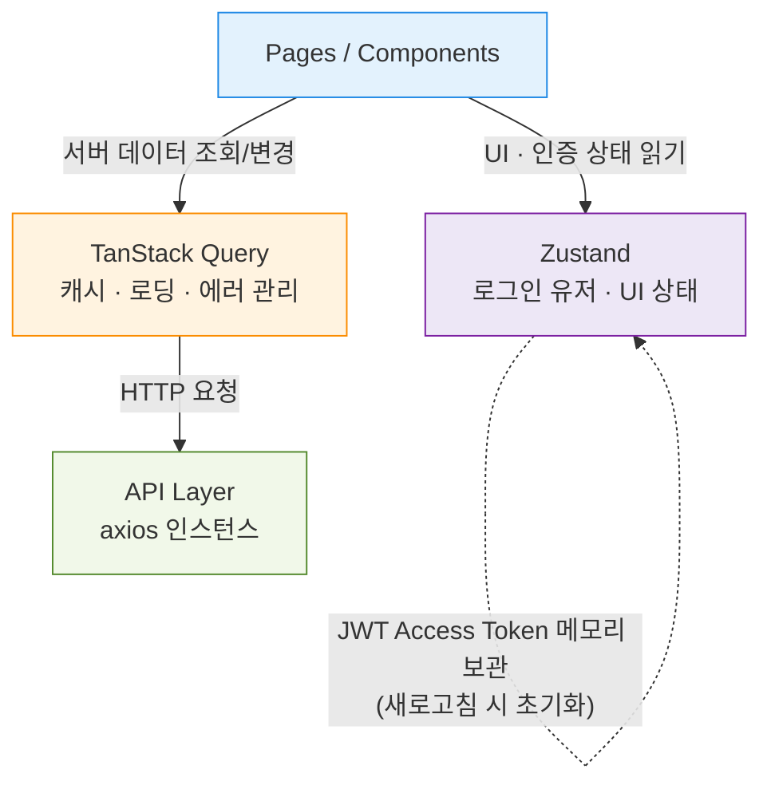
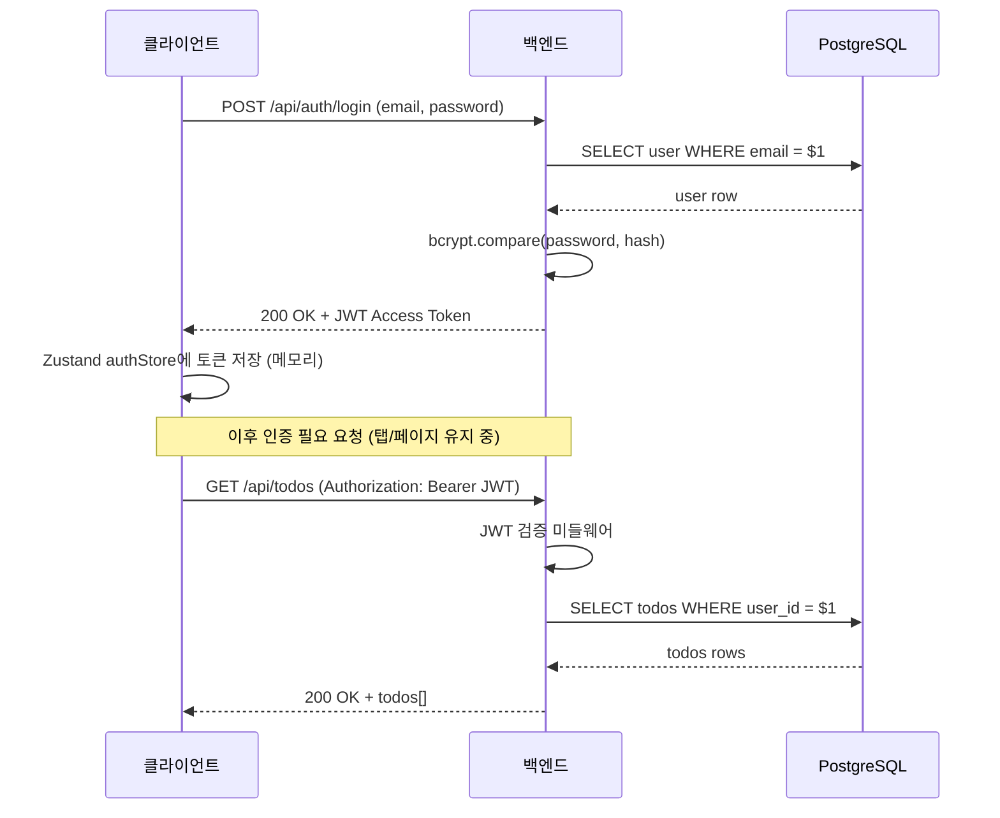
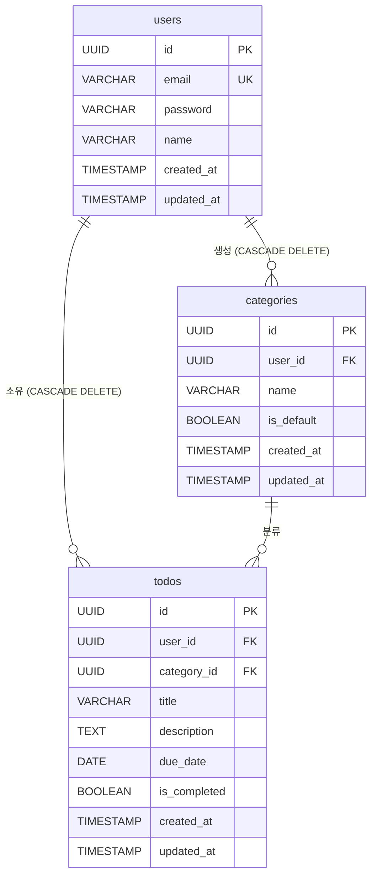
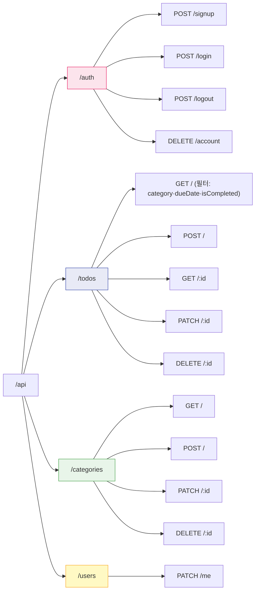

# TodoListApp — 기술 아키텍처 다이어그램

> 버전: 1.0.0 | 작성일: 2026-05-13

---

## 1. 전체 시스템 아키텍처

---

## 2. 백엔드 레이어 구조

---

## 3. 프론트엔드 상태 관리

---

## 4. 인증 흐름

---

## 5. 데이터베이스 ERD

---

## 6. API 엔드포인트 구조

