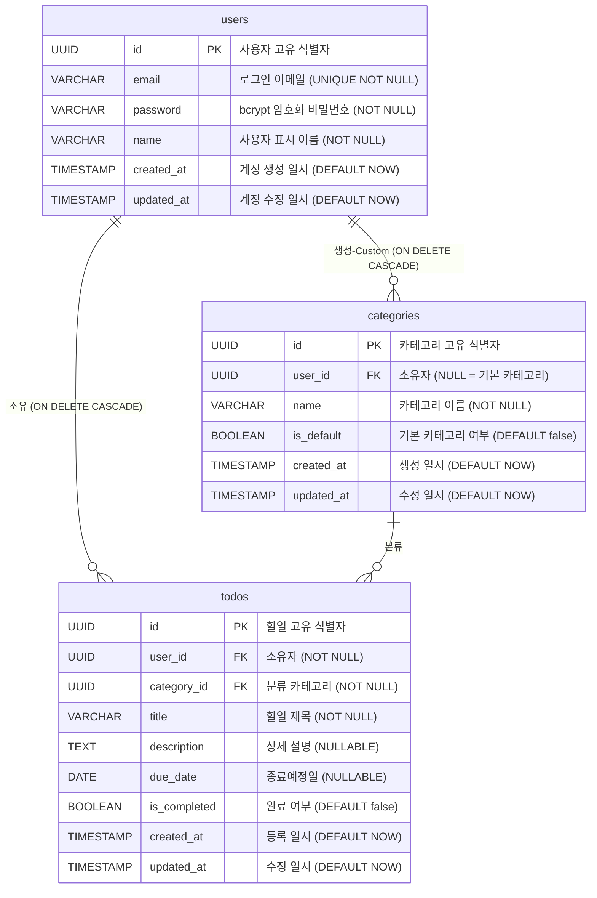

# TodoListApp — ERD (Entity Relationship Diagram)

> 버전: 1.0.0 | 작성일: 2026-05-13 | 기준 문서: 2-prd.md v1.1

---

## ERD

---

## 테이블 상세

### users

| 컬럼 | 타입 | 제약 | 설명 |
|------|------|------|------|
| id | UUID | PK, DEFAULT gen_random_uuid() | 사용자 고유 식별자 |
| email | VARCHAR(255) | UNIQUE NOT NULL | 로그인 및 식별 이메일 |
| password | VARCHAR(255) | NOT NULL | bcrypt 해시 비밀번호 |
| name | VARCHAR(100) | NOT NULL | 사용자 표시 이름 |
| created_at | TIMESTAMP | NOT NULL DEFAULT NOW() | 계정 생성 일시 |
| updated_at | TIMESTAMP | NOT NULL DEFAULT NOW() | 계정 수정 일시 |

### categories

| 컬럼 | 타입 | 제약 | 설명 |
|------|------|------|------|
| id | UUID | PK, DEFAULT gen_random_uuid() | 카테고리 고유 식별자 |
| user_id | UUID | FK → users(id) ON DELETE CASCADE, NULLABLE | NULL이면 시스템 기본 카테고리 |
| name | VARCHAR(100) | NOT NULL | 카테고리 이름 |
| is_default | BOOLEAN | NOT NULL DEFAULT false | 기본 카테고리 여부 |
| created_at | TIMESTAMP | NOT NULL DEFAULT NOW() | 생성 일시 |
| updated_at | TIMESTAMP | NOT NULL DEFAULT NOW() | 수정 일시 |

> **복합 유니크 제약**: `UNIQUE(user_id, name)` — 동일 사용자 내 카테고리명 중복 불가

### todos

| 컬럼 | 타입 | 제약 | 설명 |
|------|------|------|------|
| id | UUID | PK, DEFAULT gen_random_uuid() | 할일 고유 식별자 |
| user_id | UUID | FK → users(id) ON DELETE CASCADE, NOT NULL | 할일 소유자 |
| category_id | UUID | FK → categories(id) NOT NULL | 분류 카테고리 |
| title | VARCHAR(255) | NOT NULL | 할일 제목 |
| description | TEXT | NULLABLE | 할일 상세 설명 |
| due_date | DATE | NULLABLE | 종료예정일 |
| is_completed | BOOLEAN | NOT NULL DEFAULT false | 완료 여부 (양방향 토글 가능) |
| created_at | TIMESTAMP | NOT NULL DEFAULT NOW() | 등록 일시 |
| updated_at | TIMESTAMP | NOT NULL DEFAULT NOW() | 수정 일시 |

---

## 관계 및 제약 정리

| 관계 | 종류 | CASCADE 정책 | 비고 |
|------|------|-------------|------|
| users → todos | 1:N | ON DELETE CASCADE | 사용자 탈퇴 시 할일 전체 자동 삭제 |
| users → categories | 1:N | ON DELETE CASCADE | 사용자 탈퇴 시 사용자 정의 카테고리 자동 삭제 |
| categories → todos | 1:N | 제한 (앱 레벨) | 할일이 있는 카테고리는 삭제 불가 (BR-11) |

---

## 기본 카테고리 Seed 데이터

기본 카테고리는 `user_id = NULL`, `is_default = true`로 삽입되며 모든 사용자가 공유한다.

| id | user_id | name | is_default |
|----|---------|------|-----------|
| (UUID) | NULL | 업무 | true |
| (UUID) | NULL | 개인 | true |
| (UUID) | NULL | 기타 | true |

> 기본 카테고리는 수정 및 삭제 불가 (BR-08). "전체"는 UI 필터 옵션이며 DB 항목이 아니다.
