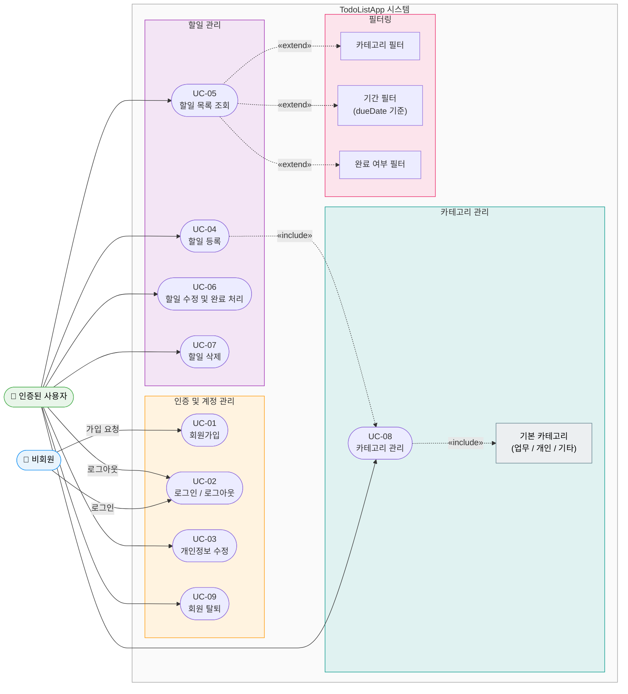

# TodoListApp Use Case Diagram

## 전체 유스케이스 다이어그램

---

## 액터 정의

| 액터 | 설명 |
|------|------|
| 비회원 (Guest) | 시스템에 미가입 또는 미인증 상태의 사용자 |
| 인증된 사용자 (Authenticated User) | 회원가입 후 JWT 토큰으로 인증된 사용자 |

---

## 유스케이스 요약

| UC | 명칭 | 주요 액터 | 관련 BR |
|----|------|----------|---------|
| UC-01 | 회원가입 | 비회원 | BR-01, BR-02 |
| UC-02 | 로그인 / 로그아웃 | 비회원, 인증된 사용자 | BR-03 |
| UC-03 | 개인정보 수정 | 인증된 사용자 | BR-02 |
| UC-04 | 할일 등록 | 인증된 사용자 | BR-03, BR-04, BR-05 |
| UC-05 | 할일 목록 조회 및 필터링 | 인증된 사용자 | BR-06, BR-07, BR-12, BR-13 |
| UC-06 | 할일 수정 및 완료 처리 | 인증된 사용자 | BR-04, BR-05, BR-06 |
| UC-07 | 할일 삭제 | 인증된 사용자 | BR-06, BR-07 |
| UC-08 | 카테고리 관리 | 인증된 사용자 | BR-08, BR-09, BR-10, BR-11 |
| UC-09 | 회원 탈퇴 | 인증된 사용자 | BR-02, BR-03, BR-14 |

---

## 관계 설명

| 관계 | 설명 |
|------|------|
| UC-04 «include» UC-08 | 할일 등록 시 카테고리 선택이 필수로 포함됨 |
| UC-05 «extend» 필터링 | 할일 목록 조회에서 카테고리/기간/완료 여부 필터를 선택적으로 적용 가능 |
| UC-08 «include» 기본 카테고리 | 카테고리 관리 시 기본 카테고리(업무/개인/기타)는 항상 제공되며 수정/삭제 불가 |
